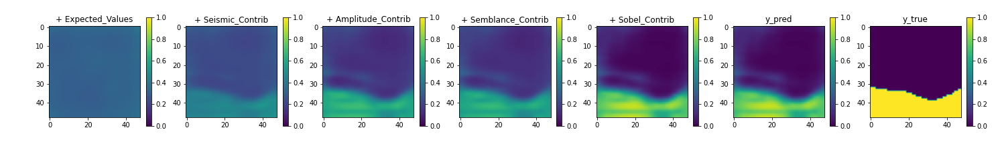

# Explainable Salt Segmentation

**Understanding how each image in a multi-input segmentation task contributes to the predicted mask.**

We start with the expected values (far left), which is similar to the mean label.
We can then add the contribution from each of the 4 input images (Seismic, Amplitude, Semblance and Sobel)
until we reach the predicted mask (y_pred), which can be directly compared to the tue mask (y_true).  

## The Project
This repository demonstrates how SHapley Additive exPlanations (SHAP) values can be obtained to give a measure of how important each feature is in a multi-input image segmentation task.
The segmentation challenge used is the [TGS Salt Identification Challenge](https://www.kaggle.com/c/tgs-salt-identification-challenge). 
Three different seismic attributes are created from the original input image to create a multi-image input (Amplitude, Semblance and Sobel Filter (edge detection)).
A Convolutional Neural Network (CNN) is then trained to predict salt masks on unseen examples. Finally, SHAP values are
calculated on a subset of the training data to explain how each input contributes to the final prediction. The theory behind SHAP is not
discussed here but additional information can be found in the [docs](https://shap.readthedocs.io/en/latest/index.html), and there is
this useful [blog](https://towardsdatascience.com/shap-explained-the-way-i-wish-someone-explained-it-to-me-ab81cc69ef30) too.

The steps to reproduce this work are: 

1. Download Data from the Kaggle website following the link above.
2. Split the data into train, validation and test datasets. The data is also downsampled from (101, 101) to (48, 48) at this point. 
3. Create seismic attributes to be used additional features to the original seismic image
4. Pre-process data for input into training. Data is downsampled from (48x48) to (24x24) at this stage for training and SHAP values calculation.
5. Build and train a Convolutiona Neural Network (CNN) Segmentation Model
6. Generate Shap Values for a small subset of the data

## Installation
The repository has been tested with python=3.9. We recommend setting up an environment and using pip to
install dependencies:
`pip install -r requirements.txt`

## Repository Structure

- [Data](Data): This folder contains all the data needed to run the repository. The data can be downloaded
[here](https://www.kaggle.com/competitions/tgs-salt-identification-challenge/data). The repository only uses the train.zip file. The file structure should be **Data --> train --> images, masks** 

- [Jobs](Jobs) - Python scripts execute steps 1-6 outlined above. 
  - [read_and_split_data.py](Jobs/read_and_split_data.py) - Steps 1 and 2
  - [process_data.py](Jobs/process_data.py) - Steps 3 and 4
  - [train.py](Jobs/train.py) - Step 5
  - [explain.py](Jobs/explain.py) - Step 6. Please note this script can take several hours and is very expensive if either a large number of images are used or if the images are large. 
- [outputs](outputs) - This directory holds any midway outputs generated at the end of each script the user may want
  to generate to avoid rerunning sections unnecessarily. 

- [Notebooks](Notebooks): This folder contains a series of jupyter notebooks that is useful for viewing and intepreting results. 
  - [Understanding_Shap_Values](Notebooks/Understanding_Shap_Values.ipynb) - Visualising and interpreting the SHAP values and how they could be useful for future use. 
  
[Presentations](Presentations) - Slides that give more detail into the motivation and decisions made in the project. 
  

## Running the code
We highly recommend using MlFlow to run this repository. 
To run the entire pipeline using MLFlow, use the following command:

`mlflow run --entry-point run_all --no-conda .`

This will read, split and process the data, train a CNN model to predict salt masks, and then create shap values
for a few samples. The --no-conda argument will make the current environment the one that is going to be used to run this command.
The entry points and their commands are described in the MLproject file.

For instance, say the data has been read in, processed and saved to disk, then the user may just want to run the
training and explain parts:

`mlflow run --entry-point train-explain --no-conda .`

Metrics and artifacts, such as the model, of each experiment are automatically logged with MLFlow.
Run the following command to observe the details of each experiment:

`mlflow ui`

## Limitations

- Generating SHAP values is very slow as the workflow does not use GPUs. Therefore, the input datas image size is 
to be reduced from 101x101 to 24x24. This significantly harms performance of the CNN to perform salt segmentation.

- As the performance of the CNN to perform salt segmentation was not the primary goal of the project, there are several
changes to the approach that would likely improve the baseline performance. 
The CNN is very basic Unet architecture and could probably be improved.
Likewise, a proper parameter search would also likely improve the segmentation performance significantly. Further regularisation would also be useful, most likely data augmentation. 

### Notes

If you're wondering why the repository is called Explainable-Christmas, then this was the name of our team
for the EAGE-Annual-Hackathon_2022. The members of the team were Edwin Brown and Marcos Jacinto. 
